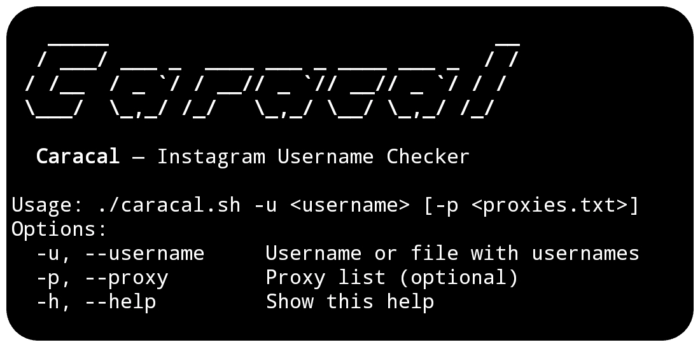
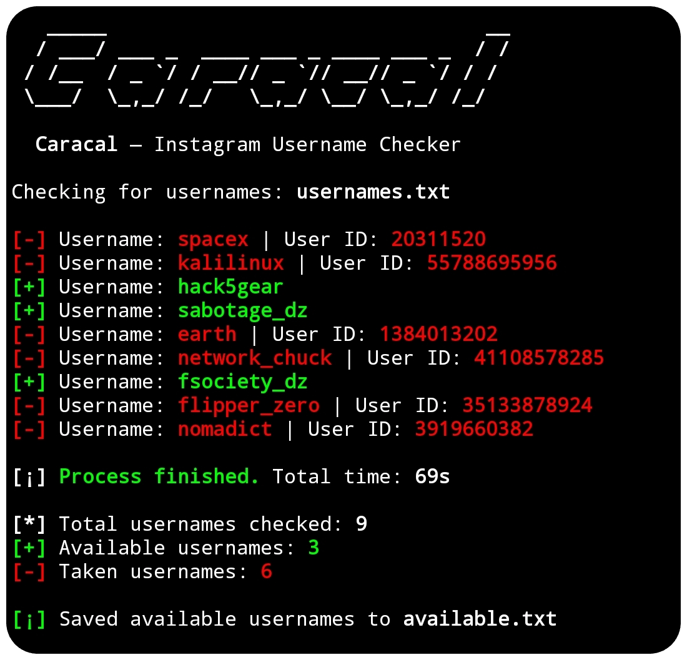

# Caracal
Instagram Username Checker

## Preview


## Install

To use the Caracal script, follow these steps:

1. Clone the repository:

    ```
    git clone https://github.com/haithamaouati/Caracal.git
    ```

2. Change to the Caracal directory:

    ```
    cd Caracal
    ```
    
3. Change the file modes
    ```
    chmod +x caracal.sh
    ```
    
5. Run the script:

    ```
    ./caracal.sh
    ```

## Usage

   Usage: `./caracal.sh -u <username> [-p <proxies.txt>]`

##### Options:

`-u`, `--username`   Username or file with usernames

`-p`, `--proxy`      Proxy list (optional)

`-h`, `--help`       Show this help message

##### Example:

Check username: `./caracal.sh -u hacker_dz`

Check file with usernames: `./caracal.sh -u usernames.txt`

Check username with proxy:
`./caracal.sh -u usernames.txt -p proxies.txt`

## Screenshot


## Dependencies

The script requires the following dependencies:

- [curl](https://curl.se/): `pkg install curl - y`
- [grep](): `pkg install grep -y`
- [sed](): `pkg install sed -y`
- [head](): `pkg install head -y`
- [shuf](): `pkg install shuf -y`

Make sure to install these dependencies before running the script.

## Environment
- Tested on [Termux]()

## Author

Made with :coffee: by **Haitham Aouati**
  - GitHub: [github.com/haithamaouati](https://github.com/haithamaouati)

## License

Caracal is licensed under [Unlicense license](LICENSE).
